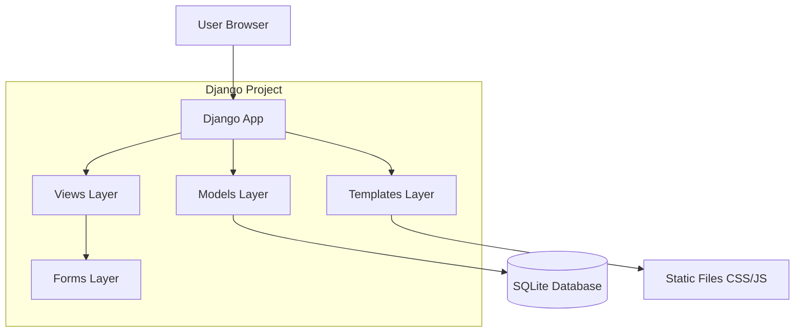
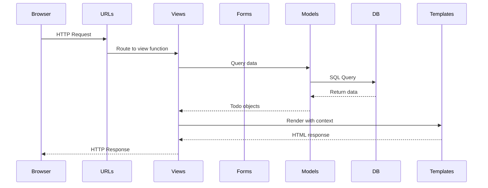
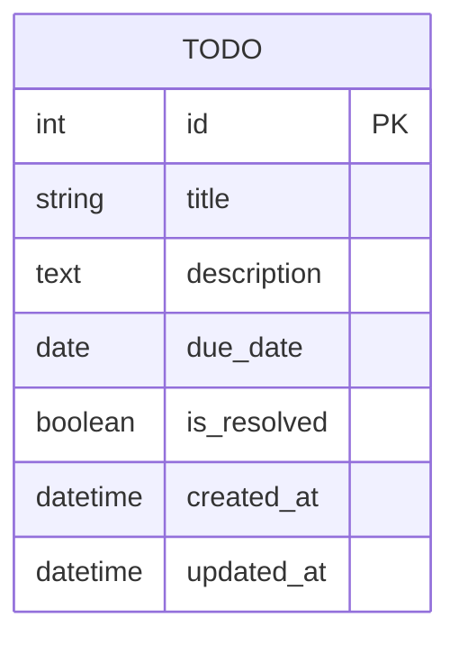
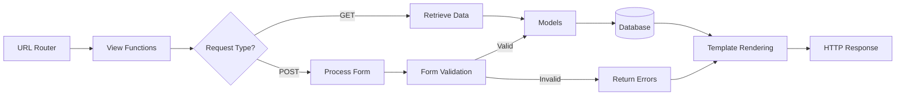
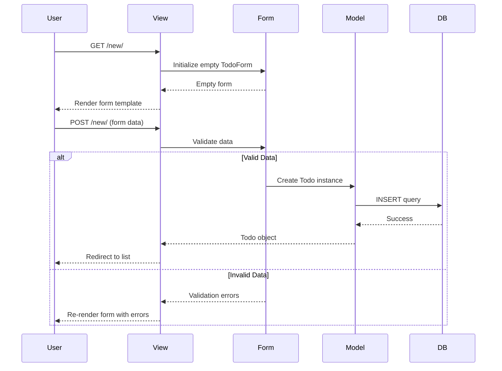
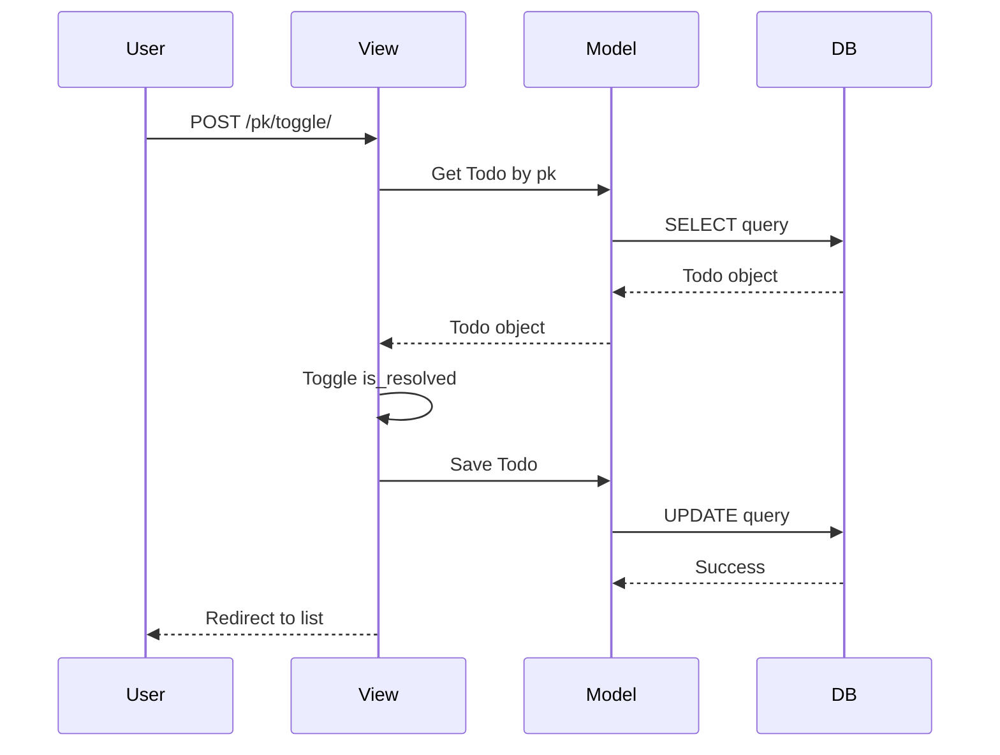
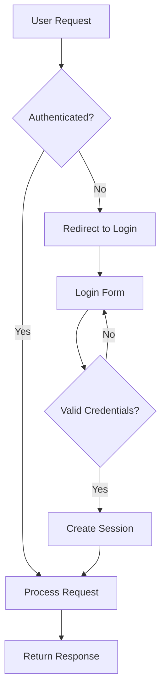
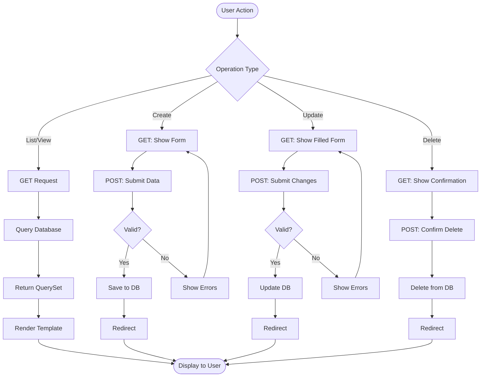
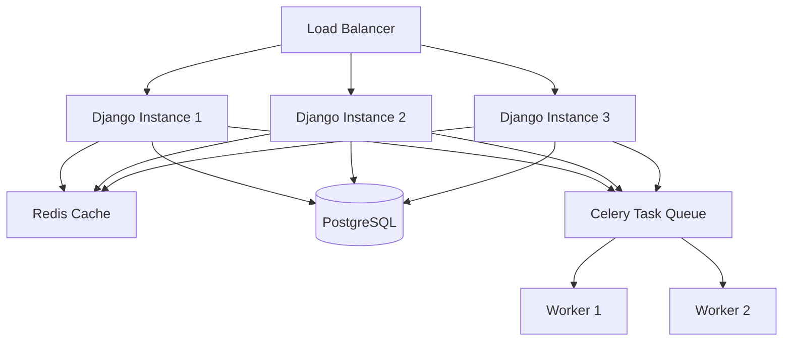
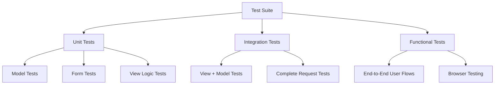

# Architecture - TODO Django App

This document provides a comprehensive overview of the TODO application's architecture, including component diagrams, data flow, and design patterns.

## 📋 Table of Contents

- [Overview](#overview)
- [Application Architecture](#application-architecture)
- [Request/Response Flow](#requestresponse-flow)
- [Database Schema](#database-schema)
- [Component Interaction](#component-interaction)
- [Design Patterns](#design-patterns)
- [Directory Structure](#directory-structure)
- [Key Components](#key-components)

---

## 🎯 Overview

The TODO app follows Django's **MTV (Model-Template-View)** architecture pattern, a variant of the traditional MVC pattern. This architectural style promotes separation of concerns and maintainability.

### MTV Pattern

- **Model**: Data layer - defines database structure and business logic
- **Template**: Presentation layer - handles HTML generation and display
- **View**: Controller layer - processes requests and coordinates between models and templates

---

## 🏗️ Application Architecture

The following diagram shows the high-level architecture of the Django TODO application:



### Layer Responsibilities

| Layer         | Responsibility                                           | Files              |
| ------------- | -------------------------------------------------------- | ------------------ |
| **Models**    | Data structure, business logic, database interaction     | `models.py`        |
| **Views**     | Request handling, application logic, response generation | `views.py`         |
| **Templates** | HTML rendering, user interface                           | `templates/*.html` |
| **Forms**     | User input validation, form rendering                    | `forms.py`         |
| **URLs**      | URL routing and pattern matching                         | `urls.py`          |

---

## 🔄 Request/Response Flow

This sequence diagram illustrates how a typical request flows through the application:



### Detailed Request Flow Example

**Scenario**: User visits the homepage to view all TODOs

1. **Browser** sends GET request to `/`
2. **URL Router** (`urls.py`) matches pattern and routes to `todo_list` view
3. **View** (`views.py`):
   - Extracts query parameters (status, search)
   - Calls Model layer to query database
4. **Model** (`models.py`):
   - Executes ORM query: `Todo.objects.all()`
   - Returns QuerySet of Todo objects
5. **View**:
   - Applies filters based on query parameters
   - Orders results
   - Passes data to template context
6. **Template** (`home.html`):
   - Receives context data
   - Renders HTML with todo list
7. **View** returns HTTP Response to **Browser**

---

## 💾 Database Schema

The application uses a simple, single-table schema:



### Field Details

| Field         | Type           | Constraints                 | Description                 |
| ------------- | -------------- | --------------------------- | --------------------------- |
| `id`          | Integer        | Primary Key, Auto-increment | Unique identifier           |
| `title`       | CharField(200) | NOT NULL                    | Task title                  |
| `description` | TextField      | NULL, BLANK                 | Optional task description   |
| `due_date`    | DateField      | NULL, BLANK                 | Optional due date           |
| `is_resolved` | BooleanField   | Default: False              | Completion status           |
| `created_at`  | DateTimeField  | Auto-add                    | Creation timestamp          |
| `updated_at`  | DateTimeField  | Auto-update                 | Last modification timestamp |

### Indexes

- **Primary Key**: `id`
- **Ordering**: `(is_resolved, due_date, -created_at)` (defined in Model Meta)

---

## 🔗 Component Interaction

This diagram shows how different components interact during various operations:



### Component Interactions by Operation

#### Creating a TODO



#### Toggling TODO Status



---

## 🎨 Design Patterns

### 1. MTV (Model-Template-View) Pattern

Django's implementation of separation of concerns:

- **Separation of Data and Presentation**: Models handle data, templates handle display
- **Reusability**: Templates can be inherited and reused
- **Maintainability**: Changes to one layer don't affect others

### 2. DRY (Don't Repeat Yourself)

Applied throughout:

- **Template Inheritance**: `base.html` extended by all pages
- **Model Methods**: Reusable logic like `is_overdue()`
- **Form Classes**: ModelForm generates form from model definition

### 3. Convention Over Configuration

Django's opinionated structure:

- Standard directory layout
- Predictable file naming (`models.py`, `views.py`, `urls.py`)
- Auto-discovery of templates and static files

### 4. Fat Models, Thin Views

Business logic in models, coordination in views:

```python
# Good: Logic in model
class Todo(models.Model):
    def is_overdue(self):
        if self.due_date is None:
            return False
        return (not self.is_resolved) and (self.due_date < timezone.localdate())

# View just uses it
def todo_list(request):
    todos = Todo.objects.all()
    # Templates can call todo.is_overdue()
```

### 5. Querysets and Lazy Evaluation

Efficient database access:

```python
# QuerySet is not evaluated yet
todos = Todo.objects.filter(is_resolved=False)

# Only evaluated when needed (when iterating in template)
return render(request, 'home.html', {'todos': todos})
```

---

## 📁 Directory Structure

Detailed breakdown of the project structure:

```
01-todo/
└── TODOapp/                          # Project root
    ├── manage.py                     # Django CLI interface
    ├── db.sqlite3                    # SQLite database file
    │
    ├── TODOapp/                      # Project configuration package
    │   ├── __init__.py               # Python package marker
    │   ├── settings.py               # Project settings & configuration
    │   ├── urls.py                   # Root URL configuration
    │   ├── wsgi.py                   # WSGI deployment interface
    │   └── asgi.py                   # ASGI deployment interface
    │
    └── todos/                        # TODO application
        ├── __init__.py               # Python package marker
        ├── models.py                 # Todo model definition
        ├── views.py                  # View functions
        ├── forms.py                  # Form classes
        ├── urls.py                   # App-specific URLs
        ├── admin.py                  # Django admin configuration
        ├── apps.py                   # App configuration
        ├── tests.py                  # Unit tests
        │
        ├── migrations/               # Database migrations
        │   ├── __init__.py
        │   ├── 0001_initial.py       # Initial migration
        │   └── ...
        │
        └── templates/                # HTML templates
            ├── 404.html              # Not found page
            ├── 500.html              # Server error page
            └── todos/                # App-specific templates
                ├── base.html         # Base template
                ├── home.html         # TODO list page
                ├── todo_form.html    # Create/Edit form
                └── todo_confirm_delete.html  # Delete confirmation
```

---

## 🧩 Key Components

### Models (`models.py`)

**Purpose**: Define data structure and business logic

```python
class Todo(models.Model):
    # Fields
    title = models.CharField(max_length=200)
    due_date = models.DateField(null=True, blank=True)
    is_resolved = models.BooleanField(default=False)
    created_at = models.DateTimeField(auto_now_add=True)
    updated_at = models.DateTimeField(auto_now=True)

    # Business logic
    def is_overdue(self):
        # Implementation
        pass

    # Metadata
    class Meta:
        ordering = ["is_resolved", "due_date", "-created_at"]
```

**Key Features:**

- ORM (Object-Relational Mapping)
- Automatic SQL generation
- Model methods for business logic
- Meta class for configuration

### Views (`views.py`)

**Purpose**: Handle HTTP requests and coordinate responses

**Types of Views in the App:**

1. **List View** (`todo_list`)
   - Displays all todos
   - Handles filtering and search
   - GET only

2. **Create View** (`todo_create`)
   - Displays empty form (GET)
   - Processes new todo (POST)

3. **Edit View** (`todo_edit`)
   - Displays pre-filled form (GET)
   - Processes updates (POST)

4. **Delete View** (`todo_delete`)
   - Shows confirmation (GET)
   - Deletes todo (POST)

5. **Toggle View** (`todo_toggle_resolved`)
   - POST only
   - Quick status toggle

### Forms (`forms.py`)

**Purpose**: Handle user input validation and rendering

```python
class TodoForm(forms.ModelForm):
    class Meta:
        model = Todo
        fields = ["title", "due_date", "is_resolved"]
        widgets = {
            "due_date": forms.DateInput(attrs={"type": "date"}),
        }
```

**Benefits:**

- Automatic form generation from model
- Built-in validation
- CSRF protection
- HTML5 input types

### URLs (`urls.py`)

**Purpose**: Map URLs to views

```python
# todos/urls.py
urlpatterns = [
    path("", views.todo_list, name="todo_list"),
    path("new/", views.todo_create, name="todo_create"),
    path("<int:pk>/edit/", views.todo_edit, name="todo_edit"),
    path("<int:pk>/delete/", views.todo_delete, name="todo_delete"),
    path("<int:pk>/toggle/", views.todo_toggle_resolved, name="todo_toggle_resolved"),
]
```

**Features:**

- Pattern matching with parameters (`<int:pk>`)
- Named URLs for reverse lookups
- Namespace support

### Templates

**Purpose**: Generate HTML dynamically

**Template Hierarchy:**

```
base.html (skeleton)
    ├── home.html (todo list)
    ├── todo_form.html (create/edit)
    └── todo_confirm_delete.html (delete confirmation)
```

**Template Features:**

- Inheritance (``)
- Blocks (``)
- Variables (`{{ todo.title }}`)
- Tags (``, ``)
- Filters (`{{ todo.created_at|date:"Y-m-d" }}`)

---

## 🔐 Security Features

### Built-in Django Security

1. **CSRF Protection**: All forms include ``
2. **SQL Injection Prevention**: ORM parameterizes queries
3. **XSS Protection**: Template auto-escaping
4. **Clickjacking Protection**: X-Frame-Options middleware
5. **HTTPS/SSL**: Configuration available in settings

### Authentication Flow (Extensible)



_Note: Current version doesn't implement authentication, but this shows how it would integrate_

---

## 📊 Data Flow Diagrams

### Complete CRUD Operations



---

## 🚀 Scalability Considerations

### Current Architecture

- **Single server**: Django development server
- **SQLite**: File-based database
- **Synchronous**: Blocking I/O

**Suitable for**: Development, small deployments, learning

### Production Scaling Options

1. **Web Server**: Gunicorn/uWSGI behind Nginx
2. **Database**: PostgreSQL/MySQL for better concurrency
3. **Caching**: Redis/Memcached for session and query caching
4. **Static Files**: CDN or dedicated static file server
5. **Load Balancing**: Multiple Django instances behind load balancer
6. **Task Queue**: Celery for background jobs

### Scaling Diagram



---

## 🧪 Testing Architecture

### Test Layers



**Test Organization:**

```python
# todos/tests.py
class TodoModelTest(TestCase):
    """Unit tests for Todo model"""

class TodoViewTest(TestCase):
    """Integration tests for views"""

class TodoFormTest(TestCase):
    """Unit tests for forms"""
```

---

## 📚 Further Reading

- [Django Design Philosophies](https://docs.djangoproject.com/en/4.2/misc/design-philosophies/)
- [Django Request/Response Cycle](https://docs.djangoproject.com/en/4.2/topics/http/)
- [Django Best Practices](https://docs.djangoproject.com/en/4.2/topics/best-practices/)
- [MTV vs MVC](https://docs.djangoproject.com/en/4.2/faq/general/#django-appears-to-be-a-mvc-framework-but-you-call-the-controller-the-view-and-the-view-the-template-how-come-you-don-t-use-the-standard-names)

---

**Note**: This architecture is designed for simplicity and learning. Production applications may require additional layers like API gateways, microservices, or event-driven architectures depending on requirements.
