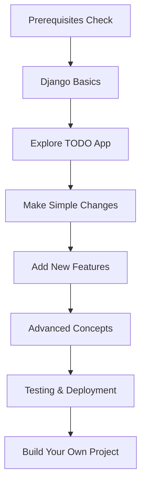

# Learning Path - TODO Django App

A structured guide to learning Django web development using this TODO application as a practical example.

## 📚 Table of Contents

- [Prerequisites](#prerequisites)
- [Learning Path Overview](#learning-path-overview)
- [Phase 1: Understanding the Basics](#phase-1-understanding-the-basics)
- [Phase 2: Exploring the TODO App](#phase-2-exploring-the-todo-app)
- [Phase 3: Making Modifications](#phase-3-making-modifications)
- [Phase 4: Advanced Features](#phase-4-advanced-features)
- [Phase 5: Production Deployment](#phase-5-production-deployment)
- [Practice Exercises](#practice-exercises)
- [Additional Resources](#additional-resources)
- [Next Steps](#next-steps)

---

## 🎯 Prerequisites

### Required Knowledge

Before starting, you should have basic understanding of:

- **Python Fundamentals** (3-4 weeks if new)
  - Variables, data types, functions
  - Object-oriented programming (classes, inheritance)
  - List comprehensions, decorators
  - Virtual environments
- **HTML/CSS Basics** (1-2 weeks if new)
  - HTML structure and common tags
  - Forms and form elements
  - Basic CSS styling
- **Command Line** (1 week if new)
  - Navigating directories
  - Running commands
  - Environment variables

### Recommended but Optional

- **Git & GitHub** - Version control basics
- **SQL Basics** - Understanding databases and queries
- **HTTP/Web Concepts** - Request/response cycle, status codes

### Estimated Time Commitment

- **Complete Beginner**: 6-8 weeks (10-15 hours/week)
- **Some Programming Experience**: 3-4 weeks (8-10 hours/week)
- **Experienced Developer**: 1-2 weeks (5-8 hours/week)

---

## 🗺️ Learning Path Overview



---

## 📖 Phase 1: Understanding the Basics

**Duration**: 1-2 weeks | **Difficulty**: ⭐

### Week 1: Django Fundamentals

#### Day 1-2: Setup and First Django Project

**Goals:**

- Install Python and Django
- Create your first Django project
- Understand the Django project structure

**Tasks:**

```bash
# Create a test project to practice
django-admin startproject myproject
cd myproject
python manage.py runserver
```

**Concepts to Learn:**

- What is Django and MTV (Model-Template-View) pattern
- Project vs. Application
- Django settings file
- Development server

**Resources:**

- [Django Official Tutorial Part 1](https://docs.djangoproject.com/en/4.2/intro/tutorial01/)
- [Django Girls Tutorial](https://tutorial.djangogirls.org/)

#### Day 3-4: Models and Databases

**Goals:**

- Understand Django ORM
- Create simple models
- Work with migrations

**Practice:**

```python
# Create a simple Book model
class Book(models.Model):
    title = models.CharField(max_length=200)
    author = models.CharField(max_length=100)
    published_date = models.DateField()

    def __str__(self):
        return self.title
```

**Tasks:**

```bash
python manage.py makemigrations
python manage.py migrate
python manage.py shell
# Try creating Book objects in the shell
```

**Key Concepts:**

- Models and fields
- Migrations
- Django ORM QuerySets
- Django Admin

#### Day 5-7: Views and Templates

**Goals:**

- Create views that handle requests
- Render templates with data
- Understand URL routing

**Practice:**

```python
# Create a simple view
def book_list(request):
    books = Book.objects.all()
    return render(request, 'books/list.html', {'books': books})
```

**Key Concepts:**

- Function-based views
- URL patterns and routing
- Template syntax (variables, tags, filters)
- Static files

---

## 🔍 Phase 2: Exploring the TODO App

**Duration**: 1 week | **Difficulty**: ⭐⭐

### Understanding the Codebase

#### Step 1: Set Up the TODO App (Day 1)

1. **Set up and run the application**

   ```bash
   # Navigate to the project
   cd 01-todo

   # Activate the virtual environment
   source venv/bin/activate  # or venv\Scripts\activate on Windows

   # If venv doesn't exist, create it first:
   # python3 -m venv venv
   # pip install django==4.2.28

   # Navigate to Django project
   cd TODOapp

   # Apply migrations and start server
   python manage.py migrate
   python manage.py runserver
   ```

2. **Create a superuser and explore admin**

   ```bash
   # From the TODOapp directory with venv activated
   python manage.py createsuperuser
   # Visit http://127.0.0.1:8000/admin/
   ```

3. **Add some test data**
   - Create 5-10 TODO items via the web interface
   - Try different combinations (with/without due dates, resolved/open)

#### Step 2: Code Walkthrough (Day 2-3)

**Read and understand each file in this order:**

1. **`todos/models.py`** - The data structure
   - What fields does Todo have?
   - How does `is_overdue()` work?
   - Why is `ordering` set in Meta?

   **Exercise**: Draw the Todo model on paper with all its fields and methods

2. **`todos/forms.py`** - Form handling
   - How does ModelForm simplify form creation?
   - What's the purpose of the widgets dictionary?

   **Exercise**: Try adding placeholder text to the title field

3. **`todos/views.py`** - Business logic
   - Trace the flow of `todo_list` view
   - How does filtering work?
   - What's the difference between GET and POST handling?

   **Exercise**: Add print statements to follow request flow

4. **`todos/urls.py`** & **`TODOapp/urls.py`** - URL routing
   - How do URLs map to views?
   - What is `include()` used for?
   - How do named URLs work?

   **Exercise**: Map out all URLs and their corresponding views

5. **Templates** - Presentation layer
   - How does template inheritance work?
   - What are template tags () vs variables ({{ }})?
   - How are forms rendered?

#### Step 3: Database Exploration (Day 4)

**Use Django shell to explore data:**

```python
python manage.py shell

# Import the model
from todos.models import Todo

# Query examples
Todo.objects.all()
Todo.objects.filter(is_resolved=False)
Todo.objects.filter(title__icontains='important')
Todo.objects.exclude(due_date=None)

# Create a todo programmatically
todo = Todo.objects.create(
    title="Learn Django ORM",
    due_date="2026-03-15",
    is_resolved=False
)

# Update a todo
todo.is_resolved = True
todo.save()

# Try the custom method
todo.is_overdue()
```

**Exercises:**

- Find all overdue todos
- Count resolved vs open todos
- Get the 5 most recent todos

#### Step 4: Request/Response Flow (Day 5-7)

**Trace a complete request:**

1. User visits `/`
2. Django matches URL in `urls.py`
3. Calls `todo_list` view in `views.py`
4. View queries database via `Todo.objects.all()`
5. Filters applied based on query parameters
6. Data passed to template
7. Template renders HTML
8. Response sent to browser

**Exercise**: Draw a diagram showing this flow

**Debugging Practice:**

```python
# Add to views to see what's happening
def todo_list(request):
    print(f"Request method: {request.method}")
    print(f"GET parameters: {request.GET}")

    # ... rest of code
```

---

## ✏️ Phase 3: Making Modifications

**Duration**: 1-2 weeks | **Difficulty**: ⭐⭐⭐

Now you'll make changes to understand how things work together.

### Level 1: Simple Modifications (Week 1)

#### Exercise 3.1: Add a Description Field

**Goal**: Add a text field for longer todo descriptions

**Steps:**

1. **Update the model** (`models.py`):

```python
class Todo(models.Model):
    title = models.CharField(max_length=200)
    description = models.TextField(blank=True)  # Add this
    due_date = models.DateField(null=True, blank=True)
    # ... rest of fields
```

2. **Create and apply migration**:

```bash
python manage.py makemigrations
python manage.py migrate
```

3. **Update the form** (`forms.py`):

```python
class TodoForm(forms.ModelForm):
    class Meta:
        model = Todo
        fields = ["title", "description", "due_date", "is_resolved"]  # Add description
        widgets = {
            "due_date": forms.DateInput(attrs={"type": "date"}),
            "description": forms.Textarea(attrs={"rows": 3}),  # Add this
        }
```

4. **Update the template** (`home.html`):

```html
<div>
  <h3>{{ todo.title }}</h3>
  
  <p>{{ todo.description }}</p>
  
  <!-- ... rest of template -->
</div>
```

**What you learned:**

- Model migrations workflow
- Form field customization
- Template conditional rendering

#### Exercise 3.2: Add Priority Levels

**Goal**: Let users set priority (Low, Medium, High)

**Steps:**

1. **Add choice field to model**:

```python
class Todo(models.Model):
    PRIORITY_CHOICES = [
        ('L', 'Low'),
        ('M', 'Medium'),
        ('H', 'High'),
    ]

    # ... existing fields ...
    priority = models.CharField(
        max_length=1,
        choices=PRIORITY_CHOICES,
        default='M'
    )
```

2. **Update ordering to include priority**:

```python
class Meta:
    ordering = ["is_resolved", "-priority", "due_date"]
```

3. **Add CSS styling based on priority** (in template or CSS file)

**Challenge**: Add color coding - red for high, yellow for medium, green for low

#### Exercise 3.3: Add Categories/Tags

**Goal**: Organize todos by category

**Hint**: This requires a Many-to-Many relationship or a separate Category model with ForeignKey

**Steps to research:**

- Django ForeignKey vs ManyToManyField
- Related objects in Django ORM
- Filtering by related objects

### Level 2: Feature Additions (Week 2)

#### Exercise 3.4: Add User Authentication

**Goal**: Each user sees only their own todos

**New Concepts:**

- Django's built-in User model
- Login/logout views
- User authentication decorators

**Resources:**

- [Django Authentication Tutorial](https://docs.djangoproject.com/en/4.2/topics/auth/)

**Steps:**

1. **Add user field to Todo**:

```python
from django.contrib.auth.models import User

class Todo(models.Model):
    user = models.ForeignKey(User, on_delete=models.CASCADE)
    # ... other fields
```

2. **Update views to filter by user**:

```python
from django.contrib.auth.decorators import login_required

@login_required
def todo_list(request):
    todos = Todo.objects.filter(user=request.user)
    # ... rest of logic
```

3. **Add login/logout pages**

#### Exercise 3.5: Add Due Date Notifications

**Goal**: Highlight todos due soon

**Implementation Ideas:**

- Add a method `is_due_soon()` to model
- Style these items differently in template
- Add a filter to show only upcoming items

#### Exercise 3.6: AJAX Toggle

**Goal**: Mark todos complete without page reload

**New Concepts:**

- JavaScript fetch API
- Django JsonResponse
- Handling AJAX requests

**Hint:**

```javascript
fetch(`/todos/${todoId}/toggle/`, {
  method: "POST",
  headers: {
    "X-CSRFToken": getCookie("csrftoken"),
  },
})
  .then((response) => response.json())
  .then((data) => {
    // Update UI without reload
  });
```

---

## 🚀 Phase 4: Advanced Features

**Duration**: 2-3 weeks | **Difficulty**: ⭐⭐⭐⭐

### Advanced Django Concepts

#### 4.1: Class-Based Views

**Convert function views to class-based views:**

```python
from django.views.generic import ListView, CreateView, UpdateView, DeleteView
from django.urls import reverse_lazy

class TodoListView(ListView):
    model = Todo
    template_name = 'todos/home.html'
    context_object_name = 'todos'

    def get_queryset(self):
        queryset = super().get_queryset()
        status = self.request.GET.get('status', 'all')

        if status == 'open':
            queryset = queryset.filter(is_resolved=False)
        elif status == 'resolved':
            queryset = queryset.filter(is_resolved=True)

        return queryset
```

**What you'll learn:**

- Generic views and when to use them
- Mixins for reusable functionality
- Method overriding in CBVs

#### 4.2: REST API with Django REST Framework

**Add API endpoints for mobile/frontend apps:**

```bash
pip install djangorestframework
```

```python
# todos/serializers.py
from rest_framework import serializers
from .models import Todo

class TodoSerializer(serializers.ModelSerializer):
    class Meta:
        model = Todo
        fields = '__all__'

# todos/api_views.py
from rest_framework import viewsets
from .models import Todo
from .serializers import TodoSerializer

class TodoViewSet(viewsets.ModelViewSet):
    queryset = Todo.objects.all()
    serializer_class = TodoSerializer
```

**Exercises:**

- Create a React or Vue.js frontend
- Build a mobile app that consumes the API
- Add token authentication

#### 4.3: Testing

**Write tests for your application:**

```python
# todos/tests.py
from django.test import TestCase, Client
from django.urls import reverse
from .models import Todo
from datetime import date, timedelta

class TodoModelTest(TestCase):
    def setUp(self):
        self.todo = Todo.objects.create(
            title="Test Todo",
            due_date=date.today() - timedelta(days=1)
        )

    def test_is_overdue(self):
        """Test that overdue detection works"""
        self.assertTrue(self.todo.is_overdue())

    def test_resolved_not_overdue(self):
        """Resolved todos should not be overdue"""
        self.todo.is_resolved = True
        self.todo.save()
        self.assertFalse(self.todo.is_overdue())

class TodoViewTest(TestCase):
    def setUp(self):
        self.client = Client()
        self.todo = Todo.objects.create(title="Test")

    def test_todo_list_view(self):
        """Test that list view returns 200"""
        response = self.client.get(reverse('todo_list'))
        self.assertEqual(response.status_code, 200)

    def test_create_todo(self):
        """Test creating a new todo"""
        response = self.client.post(reverse('todo_create'), {
            'title': 'New Todo',
            'due_date': '2026-12-31'
        })
        self.assertEqual(Todo.objects.count(), 2)
```

**Run tests:**

```bash
python manage.py test
```

#### 4.4: Caching

**Improve performance with caching:**

```python
from django.views.decorators.cache import cache_page

@cache_page(60 * 5)  # Cache for 5 minutes
def todo_list(request):
    # ... view code
```

#### 4.5: Celery for Background Tasks

**Send email reminders for due todos:**

```python
# tasks.py
from celery import shared_task
from django.core.mail import send_mail
from .models import Todo

@shared_task
def send_due_reminders():
    due_soon = Todo.objects.filter(
        due_date=date.today(),
        is_resolved=False
    )

    for todo in due_soon:
        send_mail(
            'Todo Due Today',
            f'Your todo "{todo.title}" is due today!',
            'from@example.com',
            [todo.user.email]
        )
```

---

## 🧪 Phase 5: Production Deployment

**Duration**: 1 week | **Difficulty**: ⭐⭐⭐⭐

### Deployment Journey

Follow the [DEPLOYMENT.md](DEPLOYMENT.md) guide to:

1. **Prepare for production** (Day 1-2)
   - Environment variables
   - Security settings
   - Database migration

2. **Choose a platform** (Day 3-4)
   - Try Heroku (easiest)
   - Or Railway for modern experience
   - Or Digital Ocean for more control

3. **Deploy and test** (Day 5-6)
   - Deploy application
   - Run migrations
   - Test all features

4. **Set up monitoring** (Day 7)
   - Add Sentry for error tracking
   - Set up uptime monitoring
   - Configure automated backups

---

## 💪 Practice Exercises

### Beginner Exercises

1. **Change the color scheme** of the application
2. **Add a footer** with copyright information
3. **Change the ordering** to show oldest tasks first
4. **Add a "Clear Completed"** button to delete all resolved todos
5. **Show a count** of open vs completed todos

### Intermediate Exercises

6. **Add subtasks** - Allow todos to have child tasks
7. **Implement search** by description in addition to title
8. **Add file attachments** to todos
9. **Create a weekly view** showing todos by week
10. **Add email notifications** when a todo is created
11. **Implement undo** for delete actions (soft delete)
12. **Add dark mode** toggle

### Advanced Exercises

13. **Recurring todos** - Tasks that repeat daily/weekly/monthly
14. **Collaboration** - Share todos with other users
15. **Activity log** - Track all changes to todos
16. **Export functionality** - Export todos to CSV/PDF
17. **Calendar integration** - Sync with Google Calendar
18. **Mobile app** - Build with React Native or Flutter
19. **Real-time updates** - Use WebSockets for live updates
20. **AI-powered** - Suggest task priorities or due dates

---

## 📚 Additional Resources

### Official Documentation

- [Django Documentation](https://docs.djangoproject.com/)
- [Django Tutorial](https://docs.djangoproject.com/en/4.2/intro/tutorial01/)
- [Django Best Practices](https://docs.djangoproject.com/en/4.2/misc/design-philosophies/)

### Books

- **Django for Beginners** by William S. Vincent
- **Two Scoops of Django** by Daniel Roy Greenfeld
- **Django for APIs** by William S. Vincent
- **Test-Driven Development with Python** by Harry Percival

### Video Courses

- [Corey Schafer's Django Tutorial](https://www.youtube.com/playlist?list=PL-osiE80TeTtoQCKZ03TU5fNfx2UY6U4p) (Free)
- [Django for Everybody](https://www.dj4e.com/) by Dr. Chuck (Free)
- [Real Python Django Tutorials](https://realpython.com/tutorials/django/)

### Interactive Learning

- [Django Girls Tutorial](https://tutorial.djangogirls.org/)
- [MDN Django Tutorial](https://developer.mozilla.org/en-US/docs/Learn/Server-side/Django)

### Communities

- [Django Forum](https://forum.djangoproject.com/)
- [r/django](https://www.reddit.com/r/django/)
- [Django Discord Server](https://discord.gg/django)
- [Django Users Mailing List](https://groups.google.com/g/django-users)

### Tools and Libraries

- **Django Extensions** - Useful management commands
- **Django Debug Toolbar** - Debugging tool
- **Django REST Framework** - API development
- **Celery** - Asynchronous task queue
- **Django Allauth** - Advanced authentication
- **Django Crispy Forms** - Better form styling

---

## 🎯 Next Steps

### After Completing This Learning Path

1. **Build Your Own Project**
   - Choose an idea that interests you
   - Plan the models and features
   - Build it from scratch using what you've learned

2. **Project Ideas**
   - Blog with comments and tags
   - E-commerce store
   - Social media clone
   - Recipe organizer
   - Budget tracker
   - Fitness tracker
   - Event management system
   - Library management
   - Job board
   - Real estate listing

3. **Contribute to Open Source**
   - Find Django projects on GitHub
   - Start with documentation improvements
   - Fix bugs and add features
   - Learn from code reviews

4. **Learn Related Technologies**
   - **Frontend Frameworks**: React, Vue.js
   - **Docker & Kubernetes**: Containerization
   - **PostgreSQL**: Advanced database features
   - **Redis**: Caching and message broker
   - **Elasticsearch**: Full-text search
   - **CI/CD**: GitHub Actions, GitLab CI

5. **Specialize**
   - **Backend Focus**: APIs, microservices, scalability
   - **Full Stack**: Master frontend + backend
   - **DevOps**: Deployment, monitoring, infrastructure
   - **Data Science**: Django + ML/Data Analytics

---

## 📊 Track Your Progress

### Checklist

**Phase 1: Basics**

- [ ] Completed Django official tutorial
- [ ] Understand MTV pattern
- [ ] Created simple models
- [ ] Built basic views and templates
- [ ] Connected URLs to views

**Phase 2: TODO App**

- [ ] Set up and ran the application
- [ ] Understood all models
- [ ] Traced request/response flow
- [ ] Explored Django ORM in shell
- [ ] Modified templates

**Phase 3: Modifications**

- [ ] Added new model fields
- [ ] Created and applied migrations
- [ ] Modified forms
- [ ] Added new views
- [ ] Implemented filtering/search

**Phase 4: Advanced**

- [ ] Implemented authentication
- [ ] Converted to class-based views
- [ ] Added API with DRF
- [ ] Wrote unit tests
- [ ] Implemented caching

**Phase 5: Deployment**

- [ ] Prepared for production
- [ ] Deployed to a platform
- [ ] Set up monitoring
- [ ] Configured backups

**Beyond**

- [ ] Built own project from scratch
- [ ] Contributed to open source
- [ ] Learned complementary technologies

---

## 🤝 Getting Help

When you're stuck:

1. **Read error messages carefully** - Django errors are usually helpful
2. **Check official documentation** - Django docs are excellent
3. **Search Stack Overflow** - Chances are someone had the same issue
4. **Ask in Django communities** - Forum, Reddit, Discord
5. **Use debugging tools** - print statements, Django Debug Toolbar
6. **Review the code** - Read through slowly, line by line

### How to Ask Good Questions

- Describe what you're trying to achieve
- Show what you've tried
- Include error messages (full traceback)
- Provide relevant code snippets
- Specify Django version and environment

---

**Remember**: Learning Django is a journey. Don't rush. Build things, break things, fix things. That's how you learn!

Good luck! 🚀
